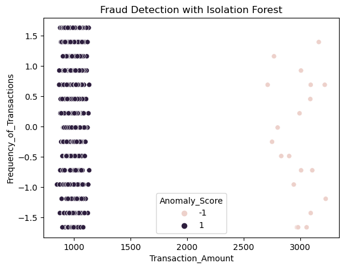

# 💸 Transaction Fraud Detection using Isolation Forest

## 🔍 Project Overview

This project focuses on detecting fraudulent bank transactions using Isolation Forest, an unsupervised anomaly detection algorithm. The objective is to identify suspicious transactions without labeled fraud data.

## 🛠️ Tech Stack & Tools

- Python, Pandas, NumPy → Data Manipulation
- Scikit-Learn → Machine Learning Model
- Matplotlib, Seaborn → Data Visualization
- Isolation Forest → Anomaly Detection

## 📊 Data Preprocessing & Feature Engineering

- Data Cleaning: Drop Columns 
-Feature Transformation: Log transformation to reduce skewness
- Standardization: Scaling features to improve model performance
- Feature Selection: Using correlation heatmaps to remove redundant variables

## 🤖 Modeling with Isolation Forest

Evaluation with AUC-ROC: Validating model performance based on its ability to detect anomalies (by usine K-means to create True Labels)

## 📸 Results

Below is a visualization of detected fraudulent transactions using Isolation Forest:

